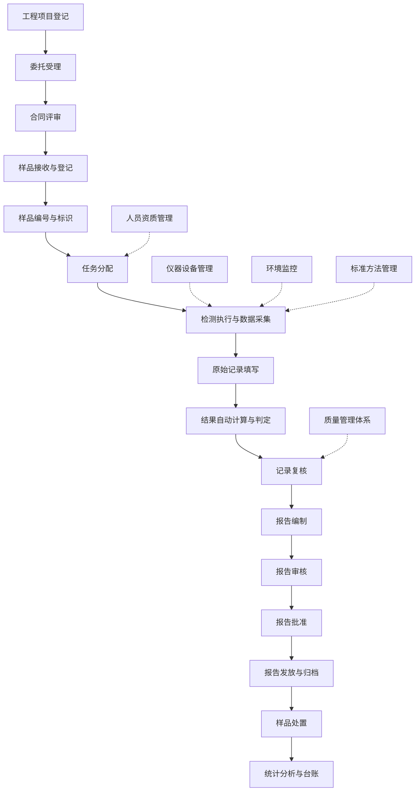
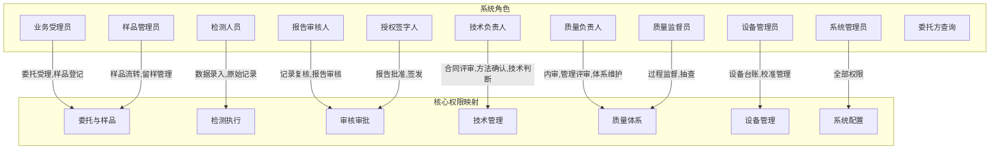
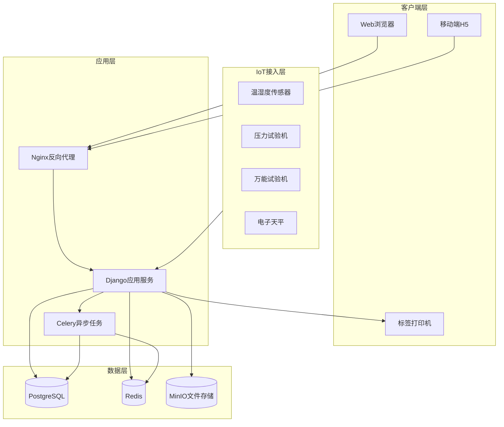

# 浦东国际机场工地试验室LIMS系统规划

## 一、项目背景与定位

- **项目名称**：浦东国际机场四期扩建工程工地试验室管理信息系统（LIMIS）
- **定位**：第三方检测机构驻场工地试验室的全流程数字化管理平台
- **项目规模**：预算588,199万元，竣工时间2028年5月，需持续服务至项目竣工
- **合规标准**：GB/T 27025-2019、CMA资质认定、JGJ/T 233-2011《建筑工程检测信息管理规程》

---

## 二、核心业务链（完整闭环）



### 业务链各环节详细说明

**环节1：工程项目登记**
- 录入工程名称（浦东国际机场四期扩建工程）、建设/施工/监理单位信息
- 录入分部/分项工程信息、施工部位
- 关联检测合同、见证人信息（见证取样制度）

**环节2：委托受理**
- 施工单位或监理单位填写《检测委托单》
- 委托单包含：委托编号、工程名称、施工部位、委托检测项目、样品信息、见证人信息
- 系统自动关联工程项目，校验委托参数完整性

**环节3：合同评审**
- 技术负责人评审检测能力（资质范围、设备状态、人员授权）
- 评审检测方法标准有效性
- 评审样品代表性和取样数量合规性
- 评审记录存档

**环节4：样品接收与登记**
- 核查样品状态（外观、数量、标识、密封性）
- 系统自动生成唯一样品编号（年份+流水号）
- 生成样品二维码/条码标签
- 记录取样日期、送样日期、样品描述
- 支持见证取样和送检标记

**环节5：样品编号与标识**
- 支持盲样管理（隐去施工单位信息）
- 支持组样管理（如混凝土试块一组3块）
- 样品状态流转追踪：待检 -> 检测中 -> 已检 -> 留样 -> 处置

**环节6：任务分配**
- 根据检测项目自动匹配有资质的检测人员
- 根据仪器设备状态自动推荐可用设备
- 支持批量任务分配
- 检测任务通知（系统内消息/短信）

**环节7：检测执行与数据采集**
- 手动录入检测数据（支持移动端）
- 对接仪器设备自动采集数据（压力机、万能试验机等）
- 环境温湿度数据自动关联
- 检测过程照片/视频记录上传

**环节8：原始记录填写**
- 系统按标准方法自动生成原始记录模板
- 自动填入设备信息、环境信息、检测人员
- 支持数据有效位数自动修约（按GB/T 8170）
- 原始记录不可篡改，支持电子签名

**环节9：结果自动计算与判定**
- 内置各类检测项目的计算公式
- 自动调取评判标准进行合格/不合格判定
- 支持异常值识别与标记
- 不合格结果自动触发预警

**环节10：记录复核**
- 复核人核查数据完整性、计算准确性
- 核查检测方法、环境条件、设备状态的合规性
- 支持退回修改（留痕）
- 质量监督员抽查签字

**环节11-13：报告编制/审核/批准**
- 系统自动生成检测报告（套用CMA标识报告模板）
- 报告包含：检测依据、检测结果、结论、备注
- 三级审批：编制人 -> 审核人 -> 批准人（授权签字人）
- 支持电子签名和电子印章
- 审批退回流程及意见记录

**环节14：报告发放与归档**
- 报告发放登记（纸质/电子）
- 报告唯一编号和二维码防伪
- 电子报告PDF生成，支持在线验证
- 归档至文档管理系统，保存期限不少于6年

**环节15：样品处置**
- 留样管理（到期提醒）
- 样品退还或销毁记录
- 废弃物处理记录

---

## 三、系统功能模块设计

### 模块1：工程项目管理
- 工程基本信息：工程名称、地点、建设/施工/监理/设计单位
- 分部分项工程管理
- 合同管理：检测合同、委托协议
- 工程进度节点关联
- 项目干系人通讯录

### 模块2：委托管理
- 委托单创建（支持模板、批量导入）
- 委托项目库（关联标准方法）
- 委托单审批流程
- 委托单打印（含见证记录）
- 委托统计（按工程/时间/类型）

### 模块3：样品管理
- 样品登记与编号
- 二维码/条码标签打印
- 样品流转追踪（全生命周期）
- 盲样管理
- 样品台账
- 留样管理与到期提醒
- 样品处置记录

### 模块4：检测任务管理
- 任务自动分配与手动调整
- 任务看板（待检/检测中/已完成）
- 龄期管理（混凝土试块7d/28d到期提醒）
- 检测进度跟踪
- 超期预警

### 模块5：数据采集与原始记录
- 支持的检测类型及对应原始记录模板：

**建筑材料检测：**

| 检测对象 | 主要检测项目 | 依据标准 |
|---------|-------------|---------|
| 水泥 | 凝结时间、安定性、胶砂强度 | GB/T 17671, GB/T 1346 |
| 钢筋 | 拉伸、弯曲、重量偏差 | GB/T 228.1, GB 1499 |
| 混凝土试块 | 抗压强度 | GB/T 50081 |
| 砂 | 细度模数、含泥量、级配 | JGJ 52 |
| 碎石 | 压碎指标、针片状、级配 | JGJ 52 |
| 混凝土外加剂 | 减水率、凝结时间差 | GB 8076 |
| 粉煤灰 | 细度、需水量比、烧失量 | GB/T 1596 |
| 防水材料 | 拉伸强度、断裂伸长率 | 相应产品标准 |
| 砌块/砖 | 抗压强度 | GB/T 2542 |

**混凝土性能检测：**
- 拌合物性能：坍落度、含气量、温度
- 力学性能：抗压强度（7d/28d/60d）
- 耐久性能：抗渗、抗冻、抗氯离子渗透

**地基与桩基检测：**
- 地基承载力：平板载荷试验
- 桩基完整性：低应变法
- 桩基承载力：静载试验、高应变法
- 基坑监测数据

**钢结构检测：**
- 焊缝无损检测（超声波、磁粉）
- 高强螺栓扭矩系数
- 防腐涂层厚度

**其他专项检测（机场特有）：**
- 屋面抗风揭性能检测
- 道面混凝土弯拉强度
- 跑道平整度（IRI）
- 沥青混合料：马歇尔稳定度、车辙试验

- 数据录入：手动 + 仪器自动采集接口
- 数据修约：自动按GB/T 8170执行
- 计算引擎：内置各标准方法的计算公式
- 自动判定：关联设计要求与标准限值

### 模块6：报告管理
- 报告自动生成（Word/PDF模板引擎）
- 报告编号规则管理
- CMA标识自动添加
- 三级审批工作流（编制-审核-批准）
- 电子签名与电子章
- 报告发放登记
- 报告作废与补发
- 报告二维码验真
- 报告台账与统计

### 模块7：仪器设备管理
- 设备台账（名称、型号、编号、精度、量程、购入日期）
- 设备分类（A/B/C类管理）
- 检定/校准管理（到期提醒，自动标记设备状态）
- 期间核查计划与记录
- 维护保养计划与记录
- 使用记录（自动关联检测任务）
- 设备故障与维修记录
- 设备停用/报废流程
- 设备量值溯源图

### 模块8：人员管理
- 人员档案（资质证书、学历、专业）
- 上岗授权管理（授权检测项目范围）
- 培训计划与记录
- 能力评价与考核
- 持证到期提醒
- 人员签名样本管理

### 模块9：环境监控
- 温湿度实时采集（对接温湿度传感器）
- 养护室温湿度监控（标准养护20±2°C, RH>=95%）
- 环境超标自动报警
- 环境记录自动归档
- 与检测记录自动关联

### 模块10：标准规范管理
- 标准库（现行/即将实施/已废止）
- 标准有效性自动核查
- 标准变更通知推送
- 检测方法与标准关联
- 方法验证/确认记录

### 模块11：质量管理体系
- **内部审核管理**：审核计划、检查表、不符合项、纠正措施
- **管理评审**：评审计划、输入材料、会议记录、输出决议
- **能力验证/比对**：参加记录、结果分析
- **质量监督**：监督计划、监督记录
- **不符合工作处理**：识别、评价、纠正、追溯
- **投诉处理**：登记、调查、处理、回复
- **风险与机遇管理**：风险识别、评价、控制措施
- **文件控制**：受控文件分发、回收、修订记录

### 模块12：耗材与试剂管理
- 试剂/耗材入库登记
- 库存台账与预警
- 领用记录
- 有效期管理
- 供应商评价

### 模块13：数据统计与分析
- 检测量统计（按时间/项目/类型）
- 合格率统计与趋势分析
- 混凝土强度发展曲线
- 检测周期分析
- 工作量统计
- 自定义报表
- 数据导出（Excel/PDF）

### 模块14：系统管理
- 用户与角色权限管理（RBAC）
- 操作日志审计
- 数据备份与恢复
- 系统参数配置
- 报告/记录模板管理
- 编号规则配置
- 消息通知配置

---

## 四、角色与权限体系



---

## 五、技术架构建议

### 推荐技术栈：Python (Django) + Vue.js 3

**后端：**
- 框架：Django 5.x + Django REST Framework
- 数据库：PostgreSQL 16（主库）+ Redis（缓存/消息队列）
- 任务队列：Celery（定时任务、报告生成、数据采集）
- 文件存储：MinIO（报告PDF、照片、附件）
- 报告引擎：python-docx + WeasyPrint（Word/PDF生成）

**前端：**
- 框架：Vue 3 + TypeScript
- UI库：Element Plus
- 图表：ECharts
- 报表打印：Print.js

**部署：**
- Docker + Docker Compose 容器化部署
- Nginx 反向代理
- 支持离线运行（工地网络不稳定场景）

### 系统架构图



---

## 六、数据库核心实体

关键数据模型（约30+核心表）：

- **Project** - 工程项目（名称、地点、各参建单位、合同信息）
- **Commission** - 委托单（委托编号、工程部位、委托项目、见证人）
- **Sample** - 样品（编号、名称、规格、数量、状态、取样日期）
- **SampleGroup** - 样品组（组样管理，如3块一组试块）
- **TestTask** - 检测任务（关联样品、检测项目、分配人员/设备）
- **TestMethod** - 检测方法（标准号、方法名称、适用范围）
- **TestParameter** - 检测参数（参数名、单位、精度、判定限值）
- **OriginalRecord** - 原始记录（模板化，JSON动态表单存储）
- **TestResult** - 检测结果（参数值、判定结论、修约后值）
- **Report** - 检测报告（编号、模板、状态、审批链）
- **ReportApproval** - 报告审批记录（审批人、意见、签名）
- **Equipment** - 仪器设备（台账信息、状态）
- **Calibration** - 检定/校准记录
- **PeriodCheck** - 期间核查记录
- **EquipUsageLog** - 设备使用记录
- **Staff** - 人员（资质、授权范围）
- **Training** - 培训记录
- **EnvRecord** - 环境记录（温度、湿度、时间）
- **Standard** - 标准规范库
- **Consumable** - 耗材台账
- **InternalAudit** - 内部审核
- **ManagementReview** - 管理评审
- **NonConformity** - 不符合项
- **Complaint** - 投诉记录
- **AuditLog** - 操作日志

---

## 七、合规性设计要点

### 匹配 GB/T 27025-2019 的关键要求

1. **公正性保证**：盲样管理、检测人员与委托信息隔离
2. **保密性**：数据加密存储、权限隔离、操作日志
3. **人员能力**：授权管理、持证上岗、培训考核记录
4. **设备溯源**：计量器具检定/校准链、期间核查
5. **方法确认**：新标准方法验证记录、偏离审批
6. **样品处置**：全生命周期追踪、唯一标识
7. **记录控制**：原始数据不可篡改、修改留痕
8. **结果报告**：信息完整、CMA标识、授权签字人签发
9. **不符合管理**：不合格品控制、纠正措施闭环
10. **内部审核与管理评审**：完整记录电子化

### 匹配见证取样制度
- 见证人信息自动关联
- 见证取样标记（每批次材料）
- 见证送检记录打印
- 见证比例统计

---

## 八、项目目录结构

```
/opt/limis/
  docker-compose.yml          # 容器编排
  .env                        # 环境变量
  README.md                   # 项目说明
  memory/                     # 开发记忆文件（AI参考）
  docs/                       # 项目文档
    PLAN.md                   # 本文件
    TODO.md                   # 任务拆分
    数据库设计.md
    接口文档.md
    部署文档.md
  backend/                    # Django后端
    manage.py
    limis/                    # 项目配置
      settings/
        base.py
        dev.py
        prod.py
      urls.py
      celery.py
    apps/
      projects/               # 工程项目管理
        models.py
        serializers.py
        views.py
        urls.py
        services.py
        filters.py
        tests/
      commissions/            # 委托管理
      samples/                # 样品管理
      testing/                # 检测任务与数据
      reports/                # 报告管理
      equipment/              # 仪器设备管理
      staff/                  # 人员管理
      environment/            # 环境监控
      standards/              # 标准管理
      quality/                # 质量管理体系
      consumables/            # 耗材管理
      statistics/             # 统计分析
      system/                 # 系统管理
    core/                     # 公共基础模块
      models.py               # 基类Model
      permissions.py          # 权限
      pagination.py           # 分页
      exceptions.py           # 异常处理
      utils/                  # 工具函数
    templates/                # 报告模板(Word/HTML)
    requirements.txt
    Dockerfile
  frontend/                   # Vue 3 前端
    src/
      views/                  # 页面（按模块分子目录）
      components/             # 公共组件
      api/                    # API接口（按模块分文件）
      stores/                 # Pinia状态管理
      router/                 # 路由
      utils/                  # 工具函数
      types/                  # TypeScript类型定义
    Dockerfile
  nginx/                      # Nginx配置
    nginx.conf
```

---

## 九、实施路线图

**第一阶段（基础框架 + 核心业务流）- 4周**
- 项目骨架搭建（Django + Vue + Docker）
- 用户认证与权限系统
- 工程项目管理模块
- 委托管理模块
- 样品管理模块（含二维码）

**第二阶段（检测执行核心）- 4周**
- 检测任务分配与管理
- 原始记录模板引擎
- 数据录入与自动计算
- 结果判定引擎
- 龄期管理与提醒

**第三阶段（报告与设备）- 3周**
- 报告模板引擎（Word/PDF生成）
- 三级审批工作流
- 电子签名
- 仪器设备全生命周期管理
- 检定/校准到期提醒

**第四阶段（质量体系与辅助）- 3周**
- 人员资质与培训管理
- 环境监控对接
- 标准规范管理
- 质量管理体系（内审/管评/不符合）
- 耗材管理

**第五阶段（统计与优化）- 2周**
- 数据统计与报表
- 数据看板（Dashboard）
- 移动端适配
- 性能优化与安全加固
- 部署文档与培训
