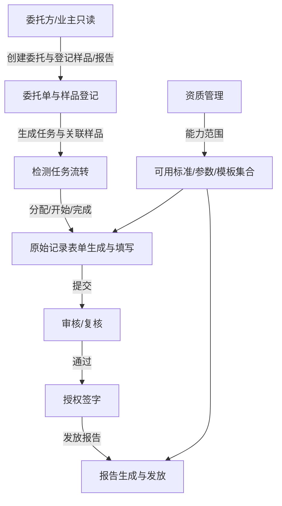

# 资质管理与端到端业务流（Qualification & Workflow）

## 1. 资质管理的作用
在 LIMIS 的质量体系中，“资质管理（Qualification）”决定了系统在下达任务前，能提供哪些可选的质量体系能力集合（例如：可用标准、可用检测方法/项目参数、可用原始记录模板）。

它的价值在于：
1. 把“能力范围”前置为数据配置，避免用户选择系统本不具备检测能力的标准/模板。
2. 让后续任务流转（委托 → 样品登记 → 检测任务 → 原始记录 → 复核/签字/发放）始终在“合规能力范围”内发生。
3. 对不同角色做 RBAC：业主/委托方仅查询，实验室/质量体系角色可维护资质配置。

## 2. 能力范围如何决定可用集合
后端新增 `QualificationProfile`（公司级、可多条但当前取“最近创建且有效”的一条作为生效配置）。

当存在生效 `QualificationProfile` 时，系统会在“拉取可选项”的接口层做过滤：
1. `GET /api/v1/standards/`：只返回 `allowed_standards` 中配置的标准规范。
2. `GET /api/v1/testing/methods/`：只返回 `allowed_test_methods` 中配置的方法集合。
3. `GET /api/v1/testing/templates/`：只返回 `allowed_record_templates` 中配置的原始记录模板集合。

因此，前端在“委托/任务创建”时下拉框获取到的集合天然受资质约束，后端也通过同样过滤保证接口不会返回不在能力范围内的选项。

## 3. 端到端业务链路（Mermaid）

## 4. 状态枚举与前端对齐（关键）
为保证“按钮显示/可编辑性/下一步入口”不因枚举不一致而阻断流程，前端与后端以数据库真实枚举为准：

### 4.1 检测任务（TestTask）
后端枚举为：`unassigned / assigned / in_progress / completed`
- `unassigned`：待分配（仅可分配人员）
- `assigned`：待检（可开始检测）
- `in_progress`：检测中（可完成检测，且可进入原始记录填写）
- `completed`：已完成

### 4.2 原始记录（OriginalRecord）
后端枚举为：`draft / pending_review / reviewed / returned`
- `draft`：草稿（可编辑并提交审核）
- `pending_review`：待复核（前端锁定编辑）
- `reviewed`：已复核（前端锁定）
- `returned`：已退回（前端锁定；若后续需要“退回后可重新提交”，应进一步在接口层补齐返回后的再提交规则）

### 4.3 样品（Sample）
样品状态随任务开始/完成推进：
- 检测中与后续业务状态由后端服务写入，前端展示应与后端枚举对齐（本项目已完成相关对齐修复）。

## 5. 权限（RBAC）约束
资质管理接口属于 `quality` 模块，RBAC 规则为：
1. 业主/委托方：仅具备相应查询权限（不允许访问资质配置维护接口）。
2. 质量体系负责人（例如 `quality_director`）：可创建/编辑/审批资质配置。
3. 质量监督员（例如 `supervisor`）：可查询资质配置（只读）。

在后端接口层通过 `lims_module='quality'` 统一鉴权，确保只有具备 `quality:view/create/edit/...` 的角色才能维护资质。

## 6. 资质管理 API（当前实现）
资质配置主要通过以下接口维护（示例）：
- `GET/POST/PATCH /api/v1/quality/qualification-profiles/`
  - 配置 `is_active`、`valid_from/valid_to`
  - 配置 `allowed_standards`
  - 配置 `allowed_test_methods`
  - 配置 `allowed_record_templates`

当生效配置存在时，上述过滤会自动影响标准/方法/模板的可选项集合。

## 7. 开发要点（避免再次偏离）
1. 资质过滤应尽量发生在接口“拉取可选项”的层（list/retrieve），避免只在前端过滤导致绕过。
2. 所有与任务推进相关的前端“可点击入口条件”必须与后端枚举一致；本项目已将任务与原始记录枚举对齐到数据库真实枚举。
3. 422/ValidationError 信息需包含字段名（便于用户知道缺哪个必填项；本项目已增强 ValidationError message 可读性）。

