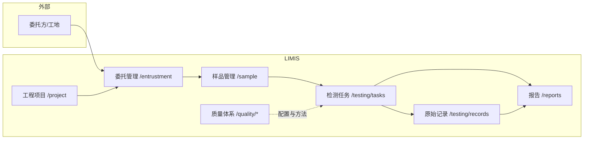

# 产品定位与价值主张

## 适用对象

- 实验室管理层：了解本系统解决什么问题、覆盖哪些业务范围。
- 信息化/运维人员：对外说明系统边界与部署形态。
- 新入职业务人员：建立「LIMIS 在整体信息化中的位置」的认知。

## 前置条件

- 理解本仓库为 **LIMIS（实验室信息管理系统）**，面向检测/试验类实验室的日常业务与质量体系管理。
- 访问方式：浏览器登录 Web 前端（默认经 Nginx 反代，API 路径为 `/api/`）。

## 页面入口（与系统模块对应）

系统采用 **Vue Router** 单页应用，主框架在登录后进入 **主布局**，左侧菜单与路由一一对应。与本 Wiki 重点相关的业务入口如下：

| 业务域 | 路由前缀 | 侧栏菜单位置 |
|--------|----------|----------------|
| 首页 | `/dashboard` | 首页 |
| 工程项目 | `/project`、`/project/:id` | 业务管理 → 工程项目 |
| 委托管理 | `/entrustment`、`/entrustment/create`、`/entrustment/:id`、`/entrustment/:id/edit` | 业务管理 → 委托管理 |
| 样品管理 | `/sample`、`/sample/register`、`/sample/:id` | 业务管理 → 样品管理 |
| 检测任务与结果 | `/testing/tasks`、`/testing/results`、`/testing/tasks/:id` | 检测管理 → 检测任务 / 检测结果 |
| 原始记录 | `/testing/records`、`/testing/records/new`、`/testing/records/:id` | 检测管理 → 原始记录 |
| 报告 | `/reports`、`/reports/:id` | 报告管理 → 报告列表 |
| 质量体系与检测基础 | `/quality/*` | 质量体系 → 各子菜单 |

> 说明：`/standard` 会 **重定向** 至 `/quality/foundation`（检测基础配置入口）。

## 字段说明

本页为产品层文档，不涉及具体表单字段；业务字段见各业务模块 Wiki 与用户指南。

## 标准操作步骤（SOP）

1. **明确组织角色**：确定实验室是否以「工程项目 → 委托 → 样品 → 检测任务 → 原始记录 → 报告」为主链路。
2. **对齐质量体系前置**：在开展大批量检测前，完成标准规范、项目参数库、原始记录模板等配置（路由见 `/quality/*`）。
3. **按角色开通权限**：通过系统管理中的用户与角色，为项目、委托、样品、任务、记录、报告等模块分配 `meta.permission` 对应的权限码（见前端路由定义）。
4. **在首页看板监控**：使用 `/dashboard` 查看委托量、待检任务、报告与设备预警等汇总指标。

## 常见错误

| 现象 | 可能原因 | 处理思路 |
|------|----------|----------|
| 认为 LIMIS 仅「报告打印」 | 忽略任务与原始记录闭环 | 从委托与样品追溯到任务与记录 |
| 与 ERP/财务系统边界不清 | 本系统侧重检测与质量数据 | 合同金额等可录入项目合同，深度财务对接需接口规划 |
| 工标网爬取与业务数据混淆 | 外部元数据辅助录入 | 标准规范维护在 `/quality/standards`，与委托单行文本可并存 |

## 数据核对清单

- [ ] 业务主链是否为：项目 → 委托 → 样品 → 任务 → 记录 → 结果（如有）→ 报告。
- [ ] 质量体系路由是否已纳入运维与培训范围（`/quality/foundation` 及各子页）。
- [ ] 生产环境 API 是否统一走 `/api/`，与前端 `axios` 的 `baseURL` 一致。

## 与上下游模块关系

- **上游**：工程项目维护参建单位、见证人等主数据，为委托单提供引用来源。
- **中游**：委托单驱动样品与检测任务；质量体系提供标准、方法、参数与记录模板。
- **下游**：原始记录与检测任务支撑报告编制与审批发放；统计看板消费任务与报告数据。

## 产品定位小结

**LIMIS** 定位为实验室检测业务的 **全流程数字化工作台**：在「工程项目」语境下管理委托与样品，通过 **检测任务** 与 **原始记录** 固化试验过程，以 **报告** 对外交付，并由 **质量体系** 模块支撑标准方法、模板与合规活动（内审、管评、不符合项等）。技术实现为 **Django REST Framework + Vue 3 + TypeScript**，前后端分离，权限基于路由 `meta.permission` 与后端模块权限校验。
