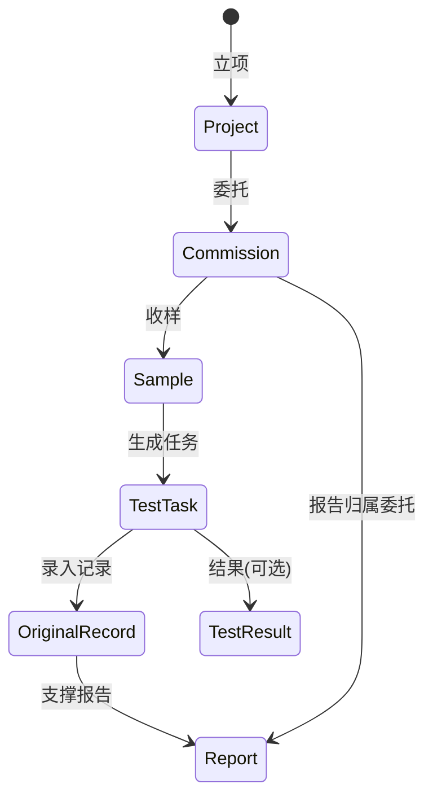

# 业务流程总览

## 适用对象

- 业务负责人：梳理端到端流程与状态流转。
- 一线用户：理解「我这一步在整体链路的哪一环」。

## 前置条件

- 已配置可登录账号，且具备相应模块权限（项目、委托、样品、任务、记录、报告等）。
- 质量体系侧建议已维护 **标准规范**、**项目参数库**、**原始记录模板**（路由 `/quality/standards`、`/quality/parameter-library`、`/quality/record-templates`），否则检测任务与记录可能无法完整落地。

## 页面入口（按流程顺序）

| 顺序 | 业务步骤 | 主要路由 |
|------|----------|----------|
| 1 | 立项与工程信息 | `/project`、`/project/:id` |
| 2 | 创建委托 | `/entrustment/create` |
| 3 | 委托评审与状态流转 | `/entrustment/:id`（编辑 `/entrustment/:id/edit`） |
| 4 | 样品登记 | `/sample/register`，列表 `/sample`，详情 `/sample/:id` |
| 5 | 生成/查看检测任务 | `/testing/tasks`，详情 `/testing/tasks/:id` |
| 6 | 填写原始记录 | `/testing/records`、`/testing/records/new`、`/testing/records/:id` |
| 7 | 查看结果（与任务同一列表组件时可筛选） | `/testing/results` |
| 8 | 编制与审批报告 | `/reports`、`/reports/:id` |

质量体系平行入口：`/quality/foundation`（配置导航）、`/quality/audit`、`/quality/review`、`/quality/nonconformity` 等。

## 字段说明（流程级）

以下为模型级关键字段，便于流程对齐；表单控件标签以界面为准。

### 工程项目（Project）

- `code`：项目编号（唯一）；`name`：工程名称；`project_type`：房建/市政/交通等；`status`：进行中/已竣工等。
- `Organization` / `Witness`：参建单位、见证人，供委托单引用。

### 委托单（Commission）

- `commission_no`：委托编号；`project`：所属项目；`construction_part`：施工部位；`commission_date`：委托日期；`client_*`：委托单位与联系人；`status`：草稿/待评审/已评审等。
- `CommissionItem`：检测对象、检测项目、标准、方法、数量等行项目。

### 样品（Sample）

- `sample_no` / `blind_no`：样品编号与盲样编号；`commission`：委托单；`sampling_date` / `received_date`：取样与收样日期；`status`：待检/检测中/已检等。

### 检测任务（TestTask）

- `task_no`：任务编号；`sample`、`commission`：关联样品与委托；`test_method`、`test_parameter`：方法与参数；`assigned_tester`：检测员；`status`：待分配→待检→检测中→已完成等。

### 原始记录（OriginalRecord）

- 与 `TestTask` 一对一；`template` + `record_data`（JSON）；`status`：草稿/待复核/已复核等。

### 报告（Report）

- `report_no`；`commission`；`status`：草稿→待审核→待批准→已批准→已发放等；`conclusion`：检测结论。

## 标准操作步骤（SOP）

### 主链路（检测委托）

1. **创建或维护工程项目**：进入 `/project`，录入项目编号、类型、地点；必要时维护参建单位与见证人。
2. **新建委托**：`/entrustment/create` 选择项目、填写委托信息与众行委托项目。
3. **委托评审**：在 `/entrustment/:id` 查看状态，按实验室制度完成评审（合同评审等后端数据支撑业务规则）。
4. **样品登记**：`/sample/register` 关联委托，生成样品编号，填写取样/收样信息。
5. **生成检测任务**：在样品详情等入口生成任务（具体按钮以界面为准）；任务出现在 `/testing/tasks`。
6. **分配与执行**：任务列表中进行分配、开始、完成；进入 `/testing/tasks/:id` 查看详情。
7. **原始记录**：`/testing/records` 新建或打开记录，绑定模板并填写 JSON 表单数据，提交复核。
8. **报告**：`/reports` 创建或编辑报告，走审批流直至发放。

### 平行链路（质量活动）

- **内审**：`/quality/audit` 记录审核计划与发现。
- **管评**：`/quality/review` 记录管理评审与决议。
- **不符合项**：`/quality/nonconformity` 登记、整改跟踪。

## 常见错误

| 现象 | 可能原因 | 处理 |
|------|----------|------|
| 样品下无检测任务 | 未生成任务或参数配置不全 | 在样品侧生成任务；检查质量参数库 |
| 原始记录无法保存 | 模板与任务方法/参数不匹配 | 在 `/quality/record-templates` 核对模板绑定 |
| 委托一直处于草稿 | 未提交评审或评审未通过 | 在委托详情查看状态与评审意见 |
| `/testing/results` 与任务列表相同 | 路由复用同一组件 | 使用筛选（如状态「已完成」）聚焦结果 |

## 数据核对清单

- [ ] 委托单 `project` 与样品 `commission.project` 链路一致。
- [ ] 任务 `sample`、`commission` 与样品、委托一致。
- [ ] 原始记录 `task` 与目标任务一对一，未重复绑定。
- [ ] 报告 `commission` 与委托一致，状态与审批记录匹配。

## 与上下游模块关系

- **上游**：工程项目、质量体系配置（方法/参数/模板）。
- **下游**：报告、统计看板（`/dashboard`）、设备与人员工作量（资源管理模块）。

## 路由对照表（用户要求范围）

| 路由 | 流程中的角色 |
|------|----------------|
| `/project` | 工程主数据与组织关系 |
| `/entrustment` | 委托创建与评审 |
| `/sample` | 样品与留样处置 |
| `/testing/*` | 任务执行、记录、结果查看 |
| `/reports` | 报告全生命周期 |
| `/quality/*` | 标准、参数库、模板、资质与质量活动 |
