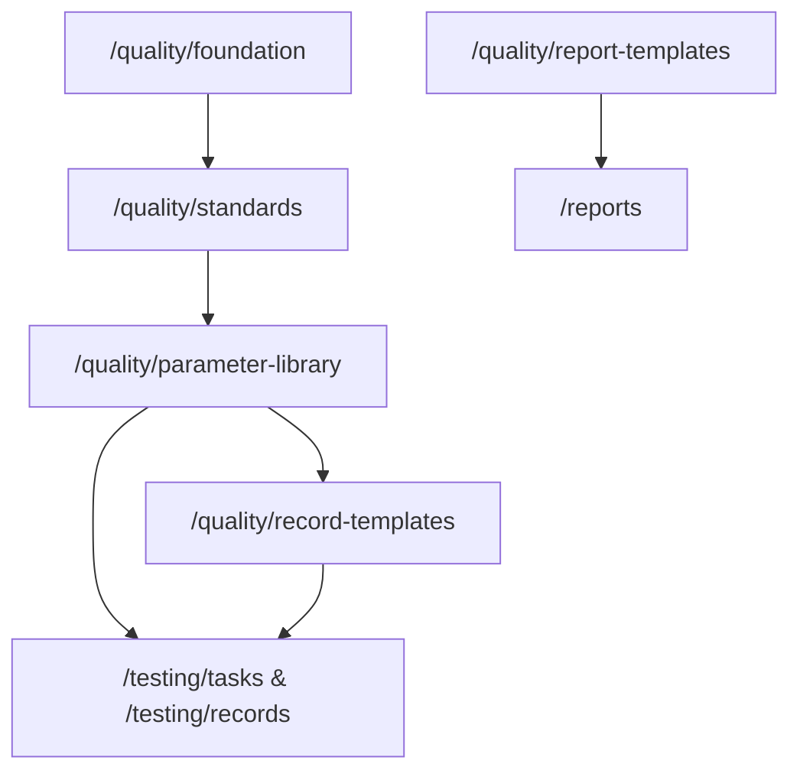

# 质量体系与检测基础配置用户指南

## 适用对象

- 质量负责人：内审、管评、不符合项管理。
- 技术负责人/方法员：标准规范、项目参数库、原始记录模板、报告模板说明。
- 资质管理员：资质档案（`/quality/qualification-profiles`）。

## 前置条件

- 各子模块权限不同，例如：
  - `testing:view`：检测基础配置、原始记录模板、报告模板说明等；
  - `system:standard:list`：标准规范列表；
  - `quality:parameter:list`：项目参数库；
  - `quality:audit:list`、`quality:review:list`、`quality:nonconformity:list`：对应质量活动；
  - `quality:view`：资质管理。
- 具体以路由 **`meta.permission`** 与角色配置为准。

## 页面入口（与路由一致）

| 功能 | 路由 | 侧栏 |
|------|------|------|
| 检测基础配置（导航 hub） | `/quality/foundation` | 质量体系 → 检测基础配置 |
| 标准规范 | `/quality/standards` | 质量体系 → 标准规范 |
| 项目参数库 | `/quality/parameter-library` | 质量体系 → 项目参数库 |
| 原始记录模板 | `/quality/record-templates` | 质量体系 → 原始记录模板 |
| 报告模板说明 | `/quality/report-templates` | 质量体系 → 报告模板 |
| 资质管理 | `/quality/qualification-profiles` | 质量体系 → 资质管理 |
| 内部审核 | `/quality/audit` | 质量体系 → 内部审核 |
| 管理评审 | `/quality/review` | 质量体系 → 管理评审 |
| 不符合项 | `/quality/nonconformity` | 质量体系 → 不符合项 |

### 兼容入口

- 旧路径 **`/standard`** 会 **重定向到** **`/quality/foundation`**（见 `router/index.ts`）。

## 字段说明

### 检测基础配置（`/quality/foundation`）

本页为 **PrerequisitesHub**：分步说明标准 → 参数库 → 记录模板 → 报告模板 的依赖顺序，并提供跳转链接，无独立业务表字段。

### 标准规范（`/quality/standards`）

对应后端标准管理（`Standard` 等），常见字段包括：标准号 `standard_no`、名称 `name`、实施日期、状态等；支持从 **工标网** 爬取元数据辅助录入（需网络与后端爬虫配置）。前端请求信封 **`code`** 需正确解包（见项目规则 `request.ts` / `unwrapCrawlPayload`）。

### 项目参数库（`/quality/parameter-library`）

维护 **检测方法（TestMethod）** 与 **检测参数（TestParameter）** 的层级关系，为 **检测任务** 提供 `test_method`、`test_parameter` 外键来源。

### 原始记录模板（`/quality/record-templates`）

| 字段（模型 RecordTemplate） | 含义 |
|----------------------------|------|
| `code` / `name` | 模板编号、名称 |
| `test_method` / `test_parameter` | 绑定方法与可选参数 |
| `schema` | JSON 表单定义 |
| `version` / `is_active` | 版本与启用状态 |

### 报告模板（`/quality/report-templates`）

对应 **ReportTemplate**：模板编号、类型、关联方法/参数、`schema` 定义等；与 **`/reports`** 编制时选用的模板名称/类型呼应。

### 资质管理（`/quality/qualification-profiles`）

维护实验室资质范围、项目等档案信息（具体字段以页面与后端为准）。

### 内部审核（`/quality/audit`）

后端模型 **InternalAudit**、**AuditFinding**：审核计划、发现项、整改等（字段见接口与表单）。

### 管理评审（`/quality/review`）

后端模型 **ManagementReview**、**ReviewDecision**：评审输入、决议事项等。

### 不符合项（`/quality/nonconformity`）

后端模型 **NonConformity**：描述、原因、措施、责任人、状态等，用于闭环跟踪。

## 标准操作步骤（SOP）

### 初始化检测基础（推荐顺序）

1. 打开 **`/quality/foundation`**，阅读步骤说明。
2. 在 **`/quality/standards`** 录入现行标准，必要时使用爬取辅助填写并 **人工核对**。
3. 在 **`/quality/parameter-library`** 为每本标准建立 **检测方法** 与 **检测参数**。
4. 在 **`/quality/record-templates`** 为方法/参数绑定 **JSON 表单** `schema`，并启用。
5. 在 **`/quality/report-templates`** 了解报告类型与模板命名约定，供报告编制选用。

### 内部审核

1. 进入 **`/quality/audit`**，新建审核计划并记录发现（AuditFinding）。
2. 将严重问题转入 **不符合项** 或关联整改。

### 管理评审

1. 进入 **`/quality/review`**，录入评审输入与输出决议。

### 不符合项

1. 进入 **`/quality/nonconformity`**，登记不符合，指定责任人，跟踪关闭。

## 常见错误

| 现象 | 原因 | 处理 |
|------|------|------|
| 工标网爬取字段不全 | 信封 `code` 类型或嵌套 `data` | 按项目已修复逻辑检查前端解包 |
| 任务无法选方法 | 参数库未建方法 | 补全 **`/quality/parameter-library`** |
| 原始记录模板与任务不匹配 | 参数与方法外键不一致 | 模板绑定需与任务一致 |
| 无权限进入某质量页 | `meta.permission` 不足 | 管理员调整角色 |

## 数据核对清单

- [ ] 标准列表与实验室 **受控标准清单** 一致。
- [ ] 方法/参数与任务、记录模板三者 **引用关系闭合**。
- [ ] 内审、管评、不符合项记录 **可追溯** 至责任人、日期。
- [ ] 资质档案与对外宣传、CMA 范围 **一致**。

## 与上下游模块关系

- **上游**：标准与参数库是检测业务与模板的 **数据源头**。
- **下游**：**检测任务**、**原始记录**、**报告** 依赖上述配置；**不符合项** 可引用具体项目/报告/任务（依实现）。
- **平行**：**内部审核**、**管理评审** 与业务操作并行，体现 ISO 体系要求。

相关路由：**`/quality/*`** 全部；业务衔接重点 **`/testing/*`**、**`/reports`**。
